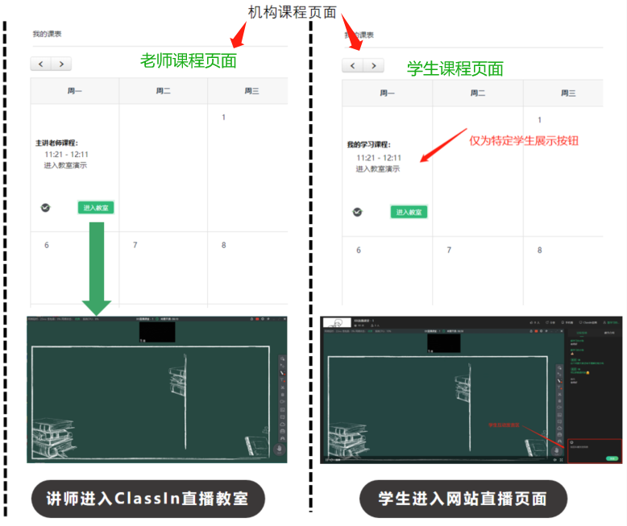

# 网页大直播方案

## 网页大直播支持的业务场景？
    
ClassIn网页大直播是指教师使用 ClassIn 教室进行授课，学生使用网页观看直播课程。大直播相比互动教室主要有这几个特点：

| |网页大直播| 互动教室 |   
| ------ | ------ |------ |   
| 观看端（学生端）人数 | 无限制 |限制 |   
| 观看端（学生端）下载 ClassIn ？ | 不需要 |需要 |   
|观看端（学生端）互动？|仅文字|音视频+丰富的互动工具|   

对互动需求不多的场景非常适用大直播。     
机构除了直接使用 eeo.cn 的大直播功能，还可以通过API对接，在自有网站或 APP 搭载 ClassIn 的大直播，无需负担过多开发和运维，支持万人大课也毫无压力。

## 大直播对接功能列表

对接后大直播可以实现
 
1. 管理员从机构自建平台/APP 创建课程课节，学生约课
1. 教师从 ClassIn 端进行授课、管理课堂。
1. 学生端从机构自建平台 APP 观看直播和回放，观看人数无限制。
1. 机构平台可以收集观看学生的信息，从而实现考勤等情况的统计

API大直播对接有全功能对接和仅对接视频两种方案。
注意：本文档提供的方案均不支持对接微信小程序。 

##  全功能对接介绍

机构可以在其平台，用 iframe 嵌套 eeo 的直播回放页面，具体技术实现请参看 [技术文档](https://docs.eeo.cn/api/zh-hans/Solutions/Live&PlaybackScenes.html)

优点： 低开发成本，无需开发网页播放器；支持设置登录账号后观看；支持 ClassIn 后台下载直播回放观看数据; 支持 API 订阅直播回放观看数据；

缺点： 界面风格不可改，需要使用 ClassIn 提供的网页界面。网页链接本身不具备鉴权功能，如有暴露链接风险会被更多人群观看；

##  仅对接视频方案

该方案 API 仅提供视频直播流和回放视频地址，直播回放页面需要机构自行开发。适合开发预算较高，对界面风格有要求的机构。
  - **优点：** 页面更加定制，方便二次开发，可以按需增加鉴权、加密、记录等功能；  
  - **缺点：** 开发成本高，需要较高技术能力，需主动完成网页播放器开发，并对各端进行适配；

两种方案仅是技术实现的区别，最终直播回放观看流程都是一样的

## 三 常见问题 QA

> Q1. 用大直播可以实现考勤记录吗？  
> A1. 可以，第一种方案，考勤由 ClassIn 的消息订阅提供原始数据，第二种方案需要机构在网页自行记录考勤

> Q2. 两种方案用户观看流畅度有区别吗？  
> A2. 没有，流畅度跟老师端的网速有关，也跟学生端网速有关，但是跟选择哪个方案本身没有关系。
