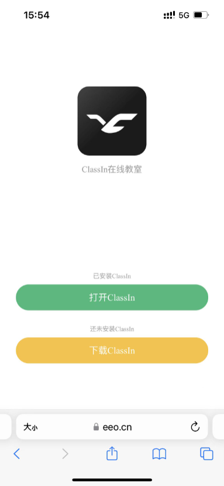

# 唤醒 ClassIn 客户端的最佳实践

    请注意：由于微信小程序相关限制，目前不支持在微信小程序中唤醒 ClassIn  
ClassIn 提供唤醒客户端并进入教室的解决方案，针对您的平台有自己用户使用页面或者 APP。本文以端的形式进行具体方式介绍。  
**对应接口文档**：https://docs.eeo.cn/api/zh-hans/getLoginLinked.html  

## 主要有三种唤醒方式

- ### 通过原生唤醒链接并进入教室

  - **功能说明**：原生唤醒链接可用于直接进入教室，若设备未安装 ClassIn，则点击不会唤起。
  - **效果预览**：
    - [从 PC/Android 端 唤醒 12345678901 ClassIn 客户端账号](classin://www.eeo.cn/enterclass?telephone=12345678901&classId=1213545&courseId=394761&schoolId=1009478)  
    - [从 iOS 唤醒 12345678901 ClassIn 客户端账号](https://www.eeo.cn/client/mobile/ios/enterclass/?telephone=12345678901&classId=1213545&courseId=394761&schoolId=1009478)  
  - **效果展示**：        

<video class="img-responsive v5_media-shadow" autoplay="true" loop="true" controls="" style="max-width:100%; height: auto;" ><source src="./img/original.mp4" type="video/mp4"></video>


  


- ### 通过唤醒中间提示页进入教室  

  - **主要用途**：使用网页唤醒功能时中间页会提示用户，如果未启动或者启动失败，则提示请重新下载安装 ClassIn 客户端。
  - **效果预览**：[从中间页唤醒 12345678901 ClassIn 客户端账号](https://www.eeo.cn/client/invoke/index.html?telephone=12345678901&classId=1213545&courseId=394761&schoolId=1009478)
  - **使用说明**：https://www.eeo.cn/client/invoke/index.html 这个链接是判断用户是否有安装客户端，如果有安装会直接提示打开客户端。适用于 PC 端和移动端平台。如果需要网页唤起并进入教室，需要将本接口返回链接中的所有参数拼接在该地址后面即可，方式如下方第二行代码所示：

  ```html
  <a href='https://www.eeo.cn/client/invoke/index.html'>打开客户端</a>
  <a href="https://www.eeo.cn/client/invoke/index.html?telephone=12345678901&classId=1213545&courseId=394761&schoolId=1009478">从网页唤醒 12345678901 ClassIn 客户端账号</a>
  ```
  - **效果展示**：     
  
<video class="img-responsive v5_media-shadow" autoplay="true" loop="true" controls="" style="max-width:100%; height: auto;" ><source src="./img/intermediate_page.mp4" type="video/mp4"></video>

  **请注意：iOS 移动端返回的链接默认嵌入了中间页；**


- ### 通过链接唤起客户端，进入LMS课程活动界面
  - **拼接规则**：classin://www.eeo.cn/enterclass?autoCourseId=班级id
  - **功能说明**：可用于唤起客户端后，直接进入课程活动页面，方便师生使用LMS功能。若设备未安装 ClassIn，则点击不会唤起。
  - **注意**：需更新 ClassIn 至5.2.1版本，不支持从微信唤起。
  
## 一 iOS 端-唤醒说明

### 1.1 H5 页面唤醒 ClassIn 客户端

- iOS 默认有中间页，支持直接在微信唤起 ClassIn；如果设备没有安装 ClassIn 的话，需跳转到浏览器打开页面，根据提示跳转 App Store 进行下载安装 ClassIn。

   

### 1.2 通过第三方 APP 直接唤醒 ClassIn 客户端

- **若不想显示中间页：** 用 ```[UIApplication sharedApplication]``` 打开中间页跳转链接，可以直接唤起 ClassIn。

- **若想直接在 APP 中唤起，不想跳转到浏览器：** 要用 webview 打开中间页跳转链接，即会在应用内打开中间页，不会跳转浏览器；即可以用内置浏览器打开中间页链接，将 ua 设置为 Safari。

## 二 Android 端-唤醒说明
    Android 端默认没有中间页，不支持直接在微信唤醒 ClassIn；
- **使用原生唤醒协议**：即```classin://```，建议将跳转链接放到指定的页面位置，绑定按钮进行唤起，原生唤醒链接在微信中打开无响应，推荐下面的使用中间页方案；
- **使用中间页唤醒**：即 ```https://www.eeo.cn/client/invoke/index.html```，需跳转浏览器打开或使用内置 webview，如果需要网页唤起并进入教室，将唤醒参数拼接在该地址后面即可； 

## 三 PC 端-唤醒说明

- **使用原生唤醒协议**：即```classin://```，通过接口获取跳转链接可直接实现跳转；
- **使用中间页唤醒**：即 ```https://www.eeo.cn/client/invoke/index.html```，如果需要网页唤起并进入教室，将唤醒参数拼接在该地址后面即可；

## 四 微信公众号跳转

- **如果您主要在微信公众号内使用，推荐采用中间页唤醒方案，详细参考[*通过唤醒中间提示页进入教室*](#通过唤醒中间提示页进入教室) 拼接参数后进行跳转，此方式无法直接跳到 ClassIn，需要从微信跳转设备自带浏览器进行唤醒**  

