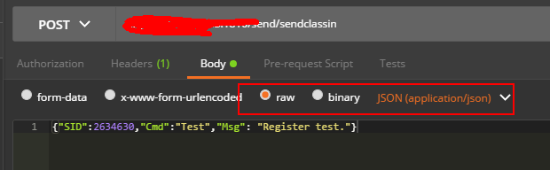

# 消息订阅说明

## 如何获取数据
1. 机构需要提供回调接口地址，来接收数据统计服务实时发送的数据（具体订阅的消息可参考**数据记录项**）。
2. 机构注册回调接口地址时，需要先进行测试，数据统计服务会向注册地址发送如下测试数据

    ```json
    {
    	"SID": 123456,
    	"Cmd": "Test",  //消息类型，Int32或String
    	"Msg": "Register test.",
    	"SafeKey": "String", //机构认证安全密钥md5(SECRET + TimeStamp)
    	"TimeStamp": 123456789    //机构认证时间戳
    }
    ```
    
    
2. 机构按以下内容回复成功应答后，测试通过完成。配置生效
```json
{
  "error_info": {       
    "errno": 1,// int类型，1表示接收方正常接收，其他码表示出错
    "error": "程序正常执行"     //此字段只作信息参考，不用来判断是否接收成功
  }
}
```


## 数据推送规则
1. 实时推送POST；
2. 数据统计服务会保证接收方接收数据的可靠性，如果发送或者接收失败，会反复重试，直到成功。
3. 接收方成功接收数据后需返回如下json格式的应答，服务收到应答后，不再尝试重发。会进到下一条消息的推送。

```json
{
  "error_info": {       
    "errno": 1,// int类型，1表示接收方正常接收，其他码表示出错
    "error": "程序正常执行"     //此字段只作信息参考，不用来判断是否接收成功
  }
}
```


## 数据记录项（以下每一列为一种类型的消息，机构可以根据需要选择订阅需要的消息类型。）
 

   为了更好的统计教师和学生的课堂行为，EEO Hamster服务将教师和学生在教室内的行为实时记录下来，并且对这些行为分门别类。目前，我们记录了如下教室数据：

| 数据类型 | 数据维度 | 推送时机 | 备注 |
|-------| -----| -----| -----|
| 举手 | 课节 | 课节内实时推送 | 以个人为单位统计举手次数和时间。如果举手放下的间隔时间较短，则单次举手时间可能为0 |
| 奖励 | 课节 | 课节内实时推送 | 以个人为单位统计奖励次数 |
| 摄像头位置 | 课节 | 课节内实时推送 |  |
| 授权 | 课节 |  课节内实时推送 |无 |
| 进入教室 | 课节 | 课节内实时推送 | 无 |
| 退出教室 | 课节 | 课节内实时推送 | 无 |
| 踢出 | 课节 | 课节内实时推送 | 无 |
| 全体静音 | 课节 | 课节内实时推送 | 无 |
| 个人静音 | 课节 | 课节内实时推送 | 无 |
| 答题器 | 课节 | 课节内实时推送 | 无 |
| 抢答器 | 课节 | 课节内实时推送 | 无 |
| 上下台 | 课节 | 课节内实时推送 | 以个人为单位统计上下台次数以及台上台下时间，如果进入教室就在台上，整节课都在教室内，并且没有被下台，则上台次数为1，台上时间为在课节时间 |
| 课节网络状态 | 课节 | 课节内实时推送 | 课节实时网络与CPU占用率状态反馈，每5分钟发送一次，为5分钟内的汇总信息 |
| 教室内设备检测 | 课节 | 课节内实时推送 | 用户在教室内的设备检测信息，包括：操作系统，CPU，网络延迟，丢包率，用户选择的麦克风名称和状态，用户选择的耳机名称和状态，用户选择的摄像头名称和状态，用户所有所有麦克风&耳机&摄像头&设备名称列表，客户端IP地址，客户端软件版本，Mac地址 |
| 教室内老师和学生求助 | 课节 | 课节内实时推送 | 上课过程中，老师端和学生端（需要在机构管理后台的 **教室配置** 里勾选），都能够向eeo.cn发起求助信息 |
| 延长课节时长 | 课节 | 课节内实时推送 | 课节结束前  8 - 3 分钟内，如果老师延长课节时长，将实时收到此推送消息 |
| 启动录课详情 | 课节 | 课节内实时推送 | 每次录课启动时推送 |
| 教室大黑板板书图片 | 课节 | 课节内实时推送 | 每次客户端清空大黑板和课节结束时，系统会把大黑板上的板书数据，转换成为图片并实时推送 |
| 直播页面用户登录 | 课节 | 课节内实时推送 | 直播过程中，登录直播页面的用户信息 |
| 直播预约 | 课节 | 用户提交预约后实时推送 | 直播开始前，用户预约的信息 |
| 直播观看明细 | 课节 | 用户关闭直播后实时推送 | 直播过程中，用户的观看直播数据 |
| 直播点赞 | 课节 | 用户点赞后实时推送 | 直播过程中，用户的点赞数据 |
| 直播商品点击明细 | 课节 | 用户点击商品后实时推送 | 直播过程中，用户点击商品的数据 |
| 课后汇总数据 | 课节 | 课节结束后（含20分钟拖堂时间）推送 | 无 |
| 课节教师和学生评价和评分 | 课节 | 课节结束后（含20分钟拖堂时间）推送 | 老师或学生退出教室，对课节的评价和评分信息 |
| 课后生成的录课文件 | 课节 | 课节结束后（含20分钟拖堂时间）推送 | 课节结束后，推送课节录制的视频文件信息 |
| 课后上传回放视频 | 课节 | 课节结束后（含20分钟拖堂时间）推送 | 用户可以通过 eeo.cn 机构管理后台（入口：课程管理 - 课节操作菜单下的“录课视频数据”）手动上传课节回放视频片段，文件上传完毕会收到此推送消息 |
| 多人多题EDU答题信息 | 课节 | 课节结束后（含20分钟拖堂时间）推送 | 多人多题的答题统计信息 |
| 网页回放观看明细 | 课节 | 用户关闭回放后实时推送 | 直播结束后，用户在网页端观看回放的数据 |
| 客户端回放观看统计 | 课节 | 用户关闭回放后实时推送 | 用户在客户端观看回放视频的统计数据 |
| 文件转换结果 | 机构 | 转换完成后实时推送 | 机构账号上传的文件的转换结果 |
| 教室外设备检测 | 机构 | 用户完成检测后实时推送 | 用户在教室外的设备检测信息，包括：操作系统，CPU，网络延迟，丢包率，用户选择的麦克风名称和状态，用户选择的耳机名称和状态，用户选择的摄像头名称和状态，用户所有所有麦克风&耳机&摄像头&设备名称列表，客户端IP地址，客户端软件版本，Mac地址 |
| 账号注销 | 机构 | 用户在客户端执行账号注销操作后实时推送 | 包括：用户UID，账号注销操作时间，账号状态 |
| 更换账号手机号码 | 机构 | 用户在客户端执行更换账号手机号码操作后实时推送 | 包括：用户UID，更换手机号码操作时间，UID对应的新手机号码 |
| 设置子账号 | 机构 | 管理员在eeo.cn学校后台成功添加/编辑子账号后实时推送 | 包括：被添加为子账号用户的UID，UID对应的手机号码，给UID用户的备注名，分配给UID的操作权限列表，操作时间 |


更加详细的描述，请见API文档相关章节：
* [课节内实时推送的消息](../datasub/details.md)
* [课节结束后推送的消息](../datasub/classrelated.md)
* [机构维度推送的消息](../datasub/schoolrelated.md)


## 常见问题Q&A

1. 收到回调通知，但取不到回调数据

    回调通知数据内容是以raw json的形式发送，不是以表单的形式；

    
    
2. 接口测试收到报错10003

    回调接口收到通知后需要回复正确的应答，此错误表明应答数据格式错误，可能不是json，或json中的字段不正确。
